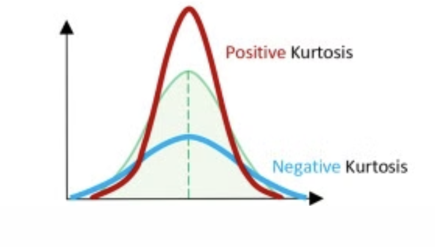

### 1. 신경세포에서 발생하는 활동전위(action potential)을 설명하고, 활동전위가 생성되는 과정을 탈분극(depolarization), 재분극(repolarization), 과분극(hyperpolarization)의 단계로 나누어 활동전위 모양을 그려라
#### 답)

### 2 . 심장의 해부학적 구조와 함께 전기적 활동전위의 진행 경로를 보여 주는 그림을 그리고, 그에 따른 ECG 파형을 완성하라. ECG의 PQRST의 위치를 표시하라.
#### 답)

### 3. 심전도 측정에서 아인트호벤의 삼각형 기법을 사용한다. 표준 사지유도 기법에서 Lead I, II, III의 전극 연결 위치를 삼각형으로 표시하고, Lead II가 가장 큰 전위를 나타내는 이유를 설명하라.
#### 답)

### 4. ECG신호와 함께 측정되는 노이즈 유형은 어떤 종류가 있는가?
#### 답)
- 전원 주파수( 50Hz / 60Hz)간섭 (powerline interference)  (고주파 성분)
- 근육 잡음 (muscle noise or movement noise) (고주파 성분)
- 베이스라인 드리프트 (baseline drift) (저주파 성분)
- 기타 아티팩트 (artifact) (저주파 성분)

### 5. ECG신호에서 노이즈를 제거하기 위한 방법 중 하나로 웨이블렛 변환(wavelettransform, WT)기법을 사용한다. WT를 사용하는 이유와 그 장점을 간략히 서술하라.
#### 답)
- 신호의 저주파 성분과 고주파 성분을 구별함
- ECG 신호를 작은 파형(웨이블렛)과 비교하여 주파수 성분 순석
- 시간에 따라 ECG 신호가 변하는 팸턴을 세밀하게 분석 가능
- 즉, 언제 어떤 주파수가 등장하는지 확인 가능
### 6. 생체신호 주파수 스펙트럼의 범위에 대해서 기술하라.
#### 답)

### 7. 아날로그 ECG신호를 디지털 값(0,1)으로 변환하기 위해서는 샘플링 주파수를 이해해야 한다. 샘플링 주파수란 무엇인가? 상세히 설명하라.
#### 답)
- 샘플링 주파수(Sampling Frequency)란?
    - 샘플링 주파수는 아날로그 신호를 디지털로 변환할 때, 1초에 몇번 신호를 샘플링 하는지 나타내는 수치이며, 단위는 보통 Hz 혹은 (샘플/초)로 표현된다.
    - 예를 들면 샘플링 주파수가 500 Hz면  1초 동안 신호를 500번 측정하여 디지털 값으로 변환한다는 뜻이다.
- 샘플링 주파수가 설정 방법
  - ECG 신호에서 150Hz 이면 샘플링 주파수는 최소 300 Hz 이상의 샘플링 주파수가 필요
  - 너무 낮으면 원래의 데이터를 표현을 못함
  - 너무 높으면 데이터가 많아져 저장 및 처리 비용 증가
### 8. 생체신호의 주파수 분석에서 많이 활용되는 퓨리에 변환(Fourier transform, FT)과 STFT(short-time Fourier transform)의 원리와 차이점을 설명하라.
#### 답)
- Fourier Transform
  - 퓨리에 변환은 시간 영역의 신호를 주파수 영역으로 변환하는 수학적 도구이다. 즉 , 어떤 신호가 어떤 주파수 성분들로 이루어져 있는지를 알려준다.
  - X(f)는 주파수 f에 해당하는 복소수 스펙트럼, x(t)는 원래의 시간 영역 신호
  - 신호를 무한히 긴 사인파들의 합으로 분해해주는 도구
  - 단점: 시간 정보 소실
  - 

- STFT(short-Time Fourier Transform)
  - 시간 정보를 보존하기 위해 고안된 방법 전체 신호를 짧은 구간으로 나누어 각 구간마다 FT를 적용한다.
  - 시간별 주파수 분석 가능
  - 

### 9. R피크검출을 위해 활용되는 Pan-Tompkins알고리즘의 블록도를 그리고, 각 단계 별로 설명하라
#### 답)

- Band - pass filter (Low -pass filtering, High - pass filtering)
- Derivative (미분)
- Squaring (제곱)
- Moving Average(이동평균 필터)
- Adaptive Threshold Detection (적응형 임계값 결정) 
- QRS 검출 완료

### 10. ECG특징추출은 크게는 2종류를 소개하였다. 통계적 특징(6개)과 HRV특징(9개)을 리스트하라.
#### 답)
- 통계적 특징(6개)
  - MinECG : ECG 신호의 최소값, 
  - MaxECG : ECG 신호의 최대값, P파나 R파의 가장 높은 위치일 가능성 있음 
  - MeanECG : 전체 ECG신호의 평균값, 기준선 또는 평형 수준을 나타냄
  - Standard DeviationECG : ECG신호의 표준편차. 신호의 전반적인 변화폭을 설명함
  - KurtosisECG : 첨도(Kurtosis) : 신호 분포의 뾰족함 정도, 큰 이상값이 있으면 증가함
  - SkewnessECG : 왜도 (Skewness): 분포의 비대칭성. Positive면 오른쪽 꼬리, Negative면 왼쪽 꼬리
- HRV 특징 변수 추출(9개)
  - minRR : RR 간격 중 가장 짧은 값
  - maxRR : RR 간격 중 가장 긴 값
  - meanRR : 모든 RR 간격의 평균값
  - SDNNRR : 모든 RR 간격의 표준편차(심박의 전체적인 변동성)
  - SDANNRR : 일정 기간으로 나눠서 평균 RR을 구하고, 그 평균들의 표준편차 -> 장기적인 심박 변화성
  - RMSSDRR : 인접한 RR간격 차이의 제곱 평균의 제곱근 -> 부교감 신경 활성화 관련
  - NNxRR : 인접한 RR간격 차이가 x ms보다 큰 쌍의 개수 (보통 x = 50ms 일 때 NN50으로 표현)
  - pNNxRR : NNxRR의 백분율(%) : (NNx / 전체 쌍 수 )x 100
  - meanHRRR : 평균 심박수(Heart Rate), 보통 60,000 / meanRR로 계산
### 11. ECG의 통계적 특징에서 kurtosis ECG, skewness ECG란 무엇인가? 그림의 모양으로 설명하라.
#### 답)

### 12. HRV(Heart Rate Variability)는 심장 박동 간의 시간 간격 차이를 의미한다. HRV는 어떤 생리학적 메커니즘을 통해 생성되는가?
#### 답)

### 13. ECG특징데이터가 인공지능 모델의 학습데이터로 활용하기 전, 그 특징들 가운데 중요도를 평가하기 위해 FSCNCA기법을 활용한다. FSCNCA원리를 설명하라
#### 답)

### 14. 이진분류의 성능평가지표에서 혼동행렬(confusion matrix)을 많이 사용한다. 혼동 행렬의 테이블을 작성하고 F1-score에 대해서 설명하라.
#### 답)

### 15. ECG특징데이터가 인공지능 모델에 학습데이터로 활용하기 전, 그 특징들 가운데 가장 중요한 특징들의 조합을 찾는 유전알고리즘(Genetic Algorithm, GA)기법이 있다. GA알고리즘이 어떻게 작동하는지, 단계별로 설명하라.
#### 답)
